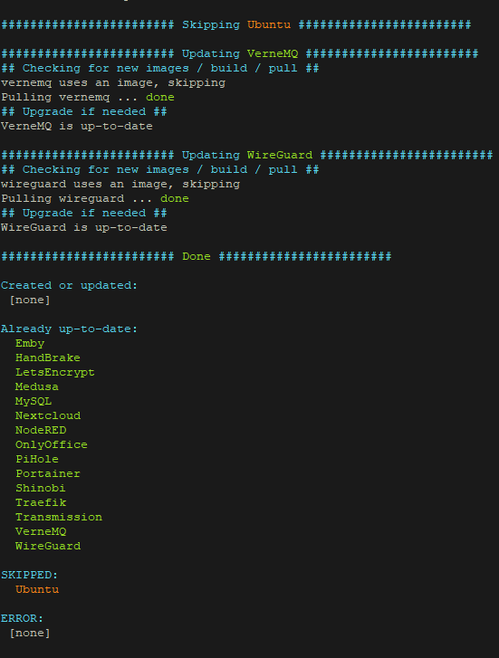

# Docker update script #

# README #

## Description ##
Simple script designed for "home" use to update multiply docker containers. Script should be run from same directory as docker-compose configuration files are contained in.
It also support building images from docker file + docker-compose file.

Usage:
Run script to update all containers (files with "!" as prefix are ignored): ./Update.sh
Run script providing a single file name to update only that container (files with "!" are NOT ignored): ./Update.sh NextCloud.yaml

Containers that don't require update (changes found) will not be restarted.

Yaml file can contain multiply containers definition, it can also contain "image" node or "build" node, e.g.:
1.
version: "3.5"
services:
  nodered:
    image: nodered/node-red
2.
version: "3.5"
services:
  nextcloud:
    build:
        context: ./
        dockerfile: Nextcloud.dockerfile

Example:
1.
    - Directory contains: Update.sh, NextCloud.yaml, Nextcloud.dockerfile, MySQL.yaml
    - Run: ./Update.sh
    - Result: Create or update (with build from docker file) NextCloud, Create or update (without build) MySQL

## Donation ##
If you like this and you think it is worth of your money or you just have to much money, feel free to donate to my Bitcoin Address :)

Bitcoin address: 17dys6rtkz8yeJLVoB7VahVYQ7TNgyuMUy